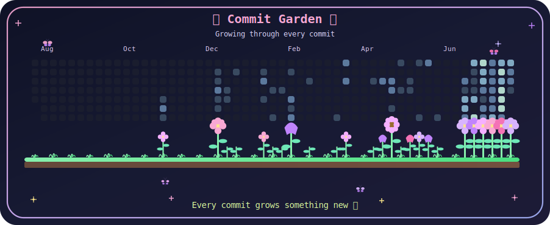

```html
<h1 align="center">
  
</h1>

<p align="center">
  
</p>

<p align="center">
  
  
</p>

<br>

<h2 align="center">🌸 About Me 🌸</h2>

<p align="center">
  Computer Engineering graduate and MSc student who enjoys transforming ideas
  into useful, user-friendly and data-driven applications.
</p>

<div align="center">

🎓 MSc Student in Computer Engineering at Konya Technical University  
💻 Computer Engineering Graduate from Konya Technical University  
🌐 Interested in Backend Development, Data Analysis and Image Processing  
🧠 Currently developing projects with ASP.NET Core, Python, Kotlin and OpenCV  
✨ I enjoy building applications that solve real-world problems  
🌱 Always learning, improving and exploring new technologies  

</div>

<br>

<h2 align="center">⚡ Tech Stack ⚡</h2>

<h3 align="center">Languages</h3>

<p align="center">
  
</p>

<h3 align="center">Backend, Mobile & Data</h3>

<p align="center">
  
</p>

<h3 align="center">Tools</h3>

<p align="center">
  
</p>

<br>

<h2 align="center">🦋 Featured Projects 🦋</h2>

<table align="center">
  <tr>
    <td width="50%" valign="top">
      <h3 align="center">🤖 AI Interview Coach</h3>
      <p align="center">
        An AI-supported interview preparation platform that generates
        interview questions, evaluates answers and provides personalized feedback.
      </p>
      <p align="center">
        <strong>ASP.NET Core · C# · EF Core · JWT · Gemini API</strong>
      </p>
    </td>

    <td width="50%" valign="top">
      <h3 align="center">📱 Optical Form Reader</h3>
      <p align="center">
        A mobile application that detects marked answers on optical forms
        and automatically compares them with an answer key.
      </p>
      <p align="center">
        <strong>Kotlin · OpenCV · ML Kit · SQLite</strong>
      </p>
    </td>
  </tr>

  <tr>
    <td width="50%" valign="top">
      <h3 align="center">🩻 Medical Image Processing</h3>
      <p align="center">
        Image-processing experiments focused on segmentation,
        masking and analysis of lung X-ray images.
      </p>
      <p align="center">
        <strong>Python · OpenCV · NumPy · Image Processing</strong>
      </p>
    </td>

    <td width="50%" valign="top">
      <h3 align="center">📊 Data Analysis Projects</h3>
      <p align="center">
        Data cleaning, exploratory analysis and visualization projects
        created to discover meaningful patterns in datasets.
      </p>
      <p align="center">
        <strong>Python · Pandas · NumPy · Power BI · SQL</strong>
      </p>
    </td>
  </tr>
</table>

<br>

<h2 align="center">📊 My GitHub Journey 📊</h2>

<p align="center">
  
</p>

<p align="center">
  

  
</p>

<br>

<h2 align="center">🔥 Contribution Streak 🔥</h2>

<p align="center">
  
</p>

<p align="center">
  <i>Consistency turns small steps into meaningful progress. ✨</i>
</p>

<br>

<h2 align="center">🌷 Commit Garden 🌷</h2>

<p align="center">
  
</p>

<p align="center">
  <i>🌱 Growing through every commit — one small step, one new flower.</i>
</p>

<br>

<h2 align="center">🌙 Current Focus 🌙</h2>

<div align="center">

🤖 Integrating real AI-powered answer evaluation into AI Interview Coach  
🌐 Improving my ASP.NET Core backend development skills  
📊 Strengthening my data analysis and SQL knowledge  
🧠 Exploring machine learning and modern AI technologies  
📚 Continuing my MSc studies in Computer Engineering  

</div>

<br>

<h2 align="center">💌 Connect With Me 💌</h2>

<p align="center">
  <a href="https://www.linkedin.com/in/begüm-yaren-öztürk00">
    
  </a>

  <a href="mailto:begumozturk0600@gmail.com">
    
  </a>

  <a href="https://github.com/yaren0600">
    
  </a>
</p>

<br>

<p align="center">
  <i>✨ Code, learn, improve and bloom. ✨</i>
</p>

<p align="center">
  
</p>
```
